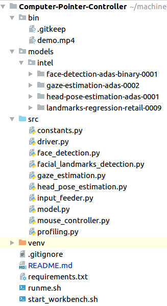

# Computer Pointer Controller

As name says, it controls the computer's mouse pointer with eye gaze.
We have used 4 pre-trained model that is provided by Open Model Zoo.
The project's main aim is to check usage of OpenVino ToolKit on different hardware
which includes openvino inference API, OpenVino WorkBench and VTune Profiler.

## Project Set Up and Installation
Just execute <i>runme.sh</i> and you are good to go !!

    ./runme.sh

## Demo
*TODO:* Explain how to run a basic demo of your model.

## Documentation
*TODO:* Include any documentation that users might need to better understand your project code. For instance, this is a good place to explain the command line arguments that your project supports.

###### Command Line Arguments for Running the app

Argument|Type|Description
| ------------- | ------------- | -------------
-f | Mandatory | Path to .xml file of Face Detection model.
-l | Mandatory | Path to .xml file of Facial Landmark Detection model.
-hp| Mandatory | Path to .xml file of Head Pose Estimation model.
-ge| Mandatory | Path to .xml file of Gaze Estimation model.
-i| Mandatory | Path to video file or enter cam for webcam
-it| Mandatory | Provide the source of video frames.
-debug  | Optional | To debug each model's output visually, type the model name with comma seperated after --debug
-ld | Optional | linker libraries if have any
-d | Optional | Provide the target device: 

###### Directory Structure

- <b>bin</b> folder contains the media files
- <b>models</b> folder contains pre-trained models from Open Model Zoo
    - intel
        1. face-detection-adas-0001
        2. gaze-estimation-adas-0002
        3. head-pose-estimation-adas-0001
        4. landmarks-regression-retail-0009
- <b>src</b> folder contains python files of the app
    + [constants.py](./src/constants.py) : All static constansts of the app located here
    + [driver.py](./src/driver.py) : Main driver script to run the app
    + [face_detection.py](./src/face_detection.py) : Face Detection related inference code
    + [facial_landmarks_detection.py](./src/facial_landmarks_detection.py) : Landmark Detection related inference code
    + [gaze_estimation.py](./src/gaze_estimation.py) : Gaze Estimation related inference code
    + [head_pose_estimation.py](./src/head_pose_estimation.py) : Head Pose Estimation related inference code
    + [input_feeder.py](./src/input_feeder.py) : input selection related code
    + [model.py](./src/model.py) : started code for any pre-trained model
    + [mouse_controller.py](./src/mouse_controller.py) : Mouse Control related utilities.
    + [profiling.py](./src/profiling.py) : To check performance of script line by line
    
- <b>.gitignore</b> listing of files that should not be uploaded to GitHub
- <b>README.md</b> File that you are reading right now.
- <b>requirements.txt</b> All the dependencies of the project listed here
- <b>runme.sh</b> one shot execution script that covers all the prerequisites of the project.
- <b>start_workbench.sh</b> Helper file from intel to start OpenVino Workbench

## Benchmarks
*TODO:* Include the benchmark results of running your model on multiple hardwares and multiple model precisions. Your benchmarks can include: model loading time, input/output processing time, model inference time etc.

- ###### face-detection-adas-0001
    Benchmark result on my <b>Intel(R) Core(TM) i7-4790 CPU @ 3.60GHz</b> using OpenVino Workbench.
    
    Precision: INT8
    
    
    Precision: FP16
    
    
    Precision: FP32
    

- ###### gaze-estimation-adas-0002
    Benchmark result on my <b>Intel(R) Core(TM) i7-4790 CPU @ 3.60GHz</b>.
    
    Precision: INT8
    
    
    Precision: FP16
    
    
    Precision: FP32
    

## Results
*TODO:* Discuss the benchmark results and explain why you are getting the results you are getting. For instance, explain why there is difference in inference time for FP32, FP16 and INT8 models.

## Stand Out Suggestions
This is where you can provide information about the stand out suggestions that you have attempted.

### Async Inference
If you have used Async Inference in your code, benchmark the results and explain its effects on power and performance of your project.

### Edge Cases
There will be certain situations that will break your inference flow. For instance, lighting changes or multiple people in the frame. Explain some of the edge cases you encountered in your project and how you solved them to make your project more robust.
